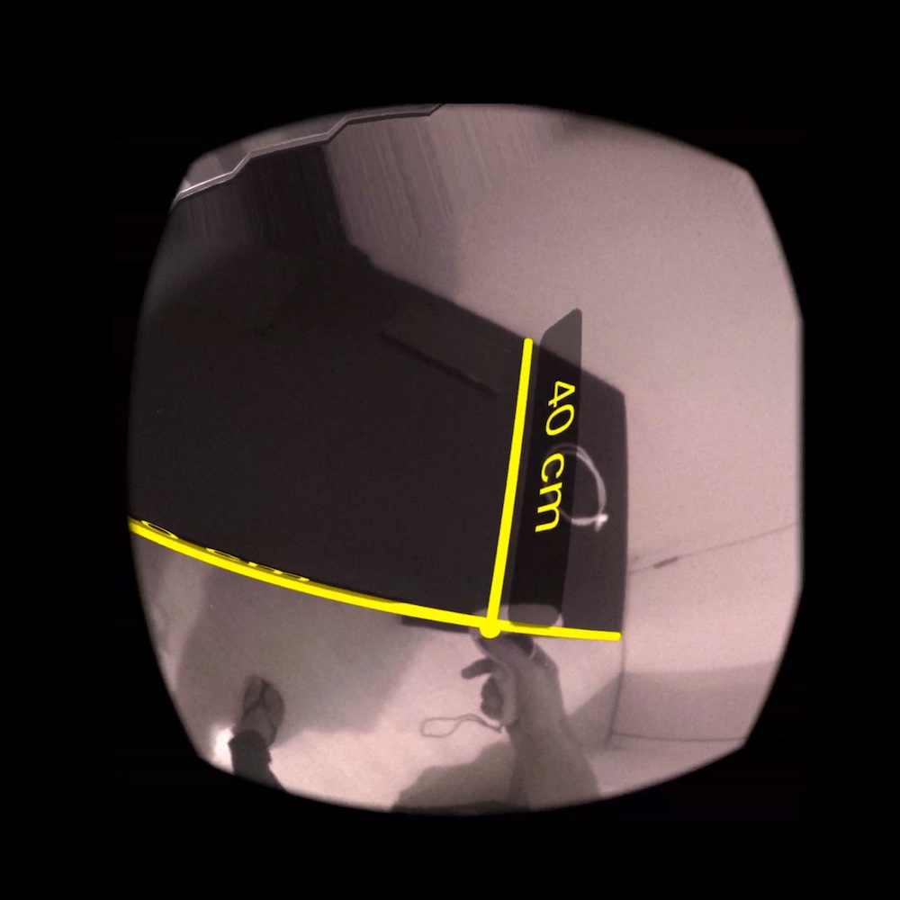
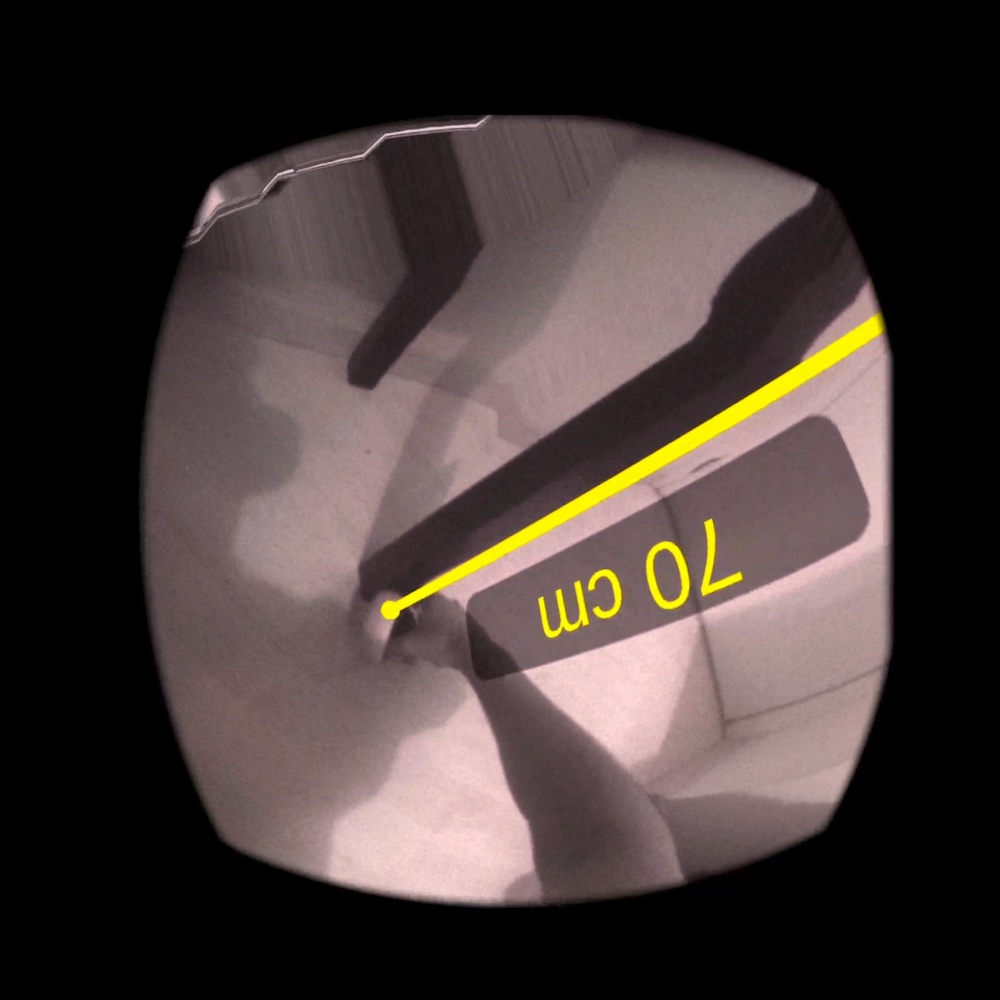
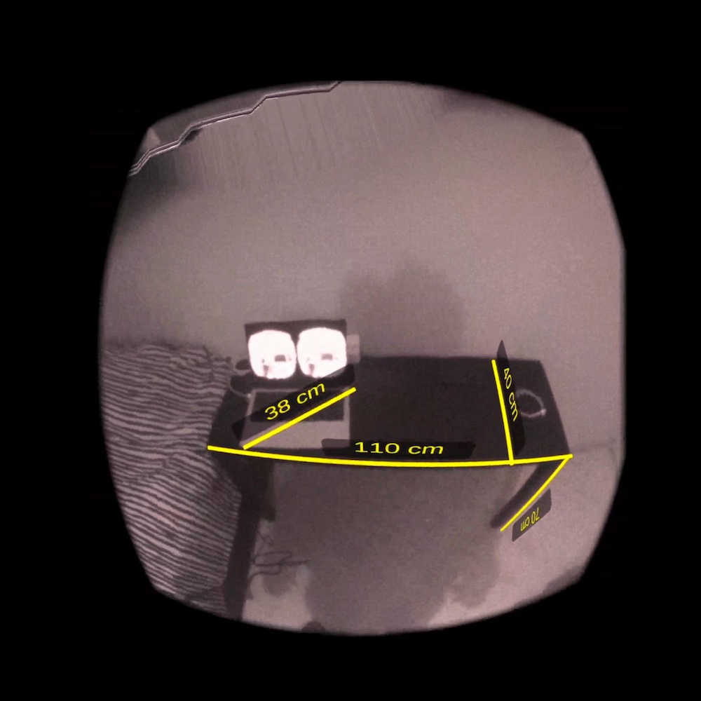

# Passthrough Measure

Use your Oculus Quest 2 with Passthrough as a tape measure. Keep in mind that this is a **very early prototype**.

## Screenshots

## Requirements

- Oculus Quest 2 (system version 35)
- [SideQuest](https://sidequestvr.com)

## How to install?

- Follow [these instructions](https://sidequestvr.com/setup-howto) to install SideQuest and setup your Oculus Quest 2 for development.

- [Download the latest APK](https://github.com/fabio914/PassthroughMeasure/releases/download/0.1/measure.apk).

- Connect your Oculus Quest to your computer, launch SideQuest and drag the APK to the top left corner of SideQuest to install it.

## How to use it?

- On your Quest 2: open "Apps", select "Unknown Sources" on the drop-down menu on the top right corner, and then select "Measure".

- Press the trigger button to start measuring, and then press it a second time to stop measuring or press "B" (on the right controller) to cancel this measurement.

- Press "B" (on the right controller) to clear all measurements.

## How to build?

- Make sure you have Unity 2020.3 LTS installed (with Android Build support).

- Clone this project.

- Open the project with Unity, then open the Package Manager, and import the Oculus Integration package (version 35.0).

- Navigate to **File > Build Settings...**, select the **Android** platform, then select your Oculus Quest as the **Run device** (if it's plugged in) and then click on **Build and Run**.

## TO-DOs

- [ ] Add support for imperial units.

- [ ] Show instructions.

- [ ] Allow the user to remove a specific measurement.

- [ ] Add option to save and export all measurements.
